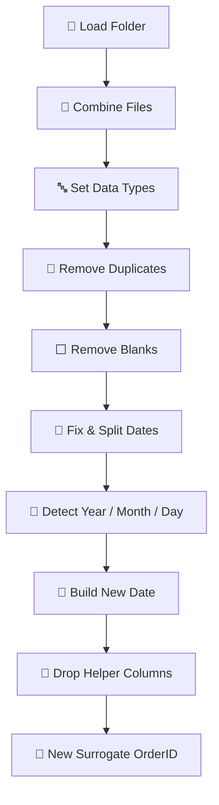

<div align="center">

# 🍕 Sales Analytics — End-to-End Excel BI Project

### From raw monthly files ➜ clean model ➜ pivot analysis ➜ interactive dashboard — 100% inside Excel


</div>

---

## 📑 Table of Contents

| # | Section |
|:-:|:--|
| 1 | [📌 Project Overview](#-project-overview) |
| 2 | [🛠️ Tools & Tech Stack](#️-tools--tech-stack) |
| 3 | [🔄 Project Workflow](#-project-workflow) |
| 4 | [🔍 Stage 1 — Data Exploration in Excel](#-stage-1--data-exploration-in-excel) |
| 5 | [🧹 Stage 2 — Data Cleaning & Transformation (Power Query)](#-stage-2--data-cleaning--transformation-power-query) |
| 6 | [🧩 Stage 3 — Data Modeling (Power Pivot)](#-stage-3--data-modeling-power-pivot) |
| 7 | [📊 Stage 4 — Pivot Table Analysis](#-stage-4--pivot-table-analysis) |
| 8 | [📈 Stage 5 — Interactive Dashboard](#-stage-5--interactive-dashboard) |
| 9 | [💡 Key Insights](#-key-insights) |
| 10 | [📁 Repository Structure](#-repository-structure) |
| 11 | [🚀 How to Use](#-how-to-use) |
| 12 | [👤 Author](#-author) |

---

## 📌 Project Overview

This project walks through a **complete business-intelligence pipeline built entirely in Microsoft Excel**.
Raw order data arrives as **multiple monthly files with inconsistent date formats, duplicates and missing values**. The goal is to turn it into a **reliable star-schema data model** and an **interactive dashboard** that answers key sales questions:

| ❓ Business Question | 📍 Answered In |
|:--|:--|
| How much did we sell, how many units, how many orders? | KPI cards |
| Which product categories drive revenue? | Sales per Category |
| At what hours of the day do orders peak? | Hourly Order Trend |
| Which products are the best sellers? | Top 10 Best-Selling |
| Which products generate the highest value? | Top 5 Most Expensive |
| Which sizes do customers prefer? | Sales by Size |

---

## 🛠️ Tools & Tech Stack

| Tool | Icon | Purpose |
|:--|:-:|:--|
| **Microsoft Excel** | 📗 | Data exploration, pivot tables, dashboard design |
| **Power Query (M)** | ⚙️ | Combine files, clean & transform data (ETL) |
| **Power Pivot** | 🧩 | Relational data model (star schema) |
| **DAX** | 🧮 | Calculated columns & measures |
| **Pivot Tables / Charts** | 📊 | Aggregation & visual analysis |
| **Slicers & Timeline** | 🎛️ | Dashboard interactivity |

---

## 🔄 Project Workflow


| Stage | Name | Tool | Output |
|:-:|:--|:--|:--|
| 1️⃣ | Data Exploration | Excel | Data-quality issue log |
| 2️⃣ | Cleaning & Transformation | Power Query | Clean `Orders` fact table |
| 3️⃣ | Data Modeling | Power Pivot + DAX | Star schema + measures |
| 4️⃣ | Analysis | Pivot Tables | Aggregated analytical views |
| 5️⃣ | Visualization | Excel Dashboard | Interactive one-page report |

---

## 🔍 Stage 1 — Data Exploration in Excel

Before transforming anything, the raw files were opened and profiled in Excel to understand **structure, content and quality**.

### 🗂️ Source Tables

| Table | Type | Key | Main Columns |
|:--|:-:|:--|:--|
| **Orders** (one file per month) | 🟦 Fact | `OrderID` | `CustomerID`, `ProductID`, `OrderDate`, `Quantity` |
| **Products** | 🟩 Dimension | `ProductID` | `ProductName`, `Category`, `Price` |
| **Customers** | 🟩 Dimension | `CustomerID` | `Firstname`, `Lastname`, `Region` |

### 🧪 Exploration Checks

| Check | Excel Technique | Purpose |
|:--|:--|:--|
| Structure & headers | Visual scan, `Ctrl + ↓ / →` | Confirm columns are consistent across files |
| Row counts | `COUNTA`, status bar | Know data volume per month |
| Duplicates | Conditional Formatting ➜ Duplicate Values, `COUNTIF` | Detect repeated `OrderID`s |
| Missing values | Filter ➜ (Blanks), `COUNTBLANK` | Find empty `Quantity` / `ProductID` |
| Date formats | Filters, `ISNUMBER`, `ISTEXT` | Detect text dates & mixed formats |
| Value ranges | `MIN`, `MAX`, sorting | Spot outliers & invalid values |

### ⚠️ Data-Quality Issues Found

| # | Issue | Column | Impact | Fix (Stage 2) |
|:-:|:--|:--|:--|:--|
| 1 | 📁 Data split across **multiple monthly files** | — | Manual copy-paste is error-prone | Folder connector + append |
| 2 | 🔁 **Duplicate orders** | `OrderID` | Inflated sales & quantity | Remove duplicates |
| 3 | ⬜ **Missing quantities** | `Quantity` | Sales can't be calculated | Filter out blanks |
| 4 | ⬜ **Missing products** | `ProductID` | Breaks product relationship | Filter out blanks |
| 5 | 📅 **Mixed date separators** (`/` and `-`) | `OrderDate` | Dates stored as text | Standardize separator |
| 6 | 🔀 **Inconsistent date part order** (year first *or* last; day/month swapped) | `OrderDate` | Wrong / invalid dates | Rebuild date from parts |
| 7 | 🏷️ Month only reliable in the **file name** | `Source.Name` | Ambiguous day vs. month | Extract month from file name |

---

## 🧹 Stage 2 — Data Cleaning & Transformation (Power Query)

All cleaning is done in **Power Query** so the process is **fully automated and refreshable** — dropping a new monthly file into the folder and pressing **Refresh** reruns every step.

### 🧭 Transformation Pipeline



### 📋 Step-by-Step Breakdown

| # | Phase | Applied Step | What It Does | Why |
|:-:|:--|:--|:--|:--|
| 1 | 📥 Ingest | `Source` | Connects to the **Orders folder** with `Folder.Files` | Automatically picks up every monthly file |
| 2 | 📥 Ingest | `Filtered Hidden Files1` | Excludes hidden/system files | Avoids loading temp files |
| 3 | 📥 Ingest | `Invoke Custom Function1` | Runs the `Transform File` function on each file | Same parsing logic for every file |
| 4 | 📥 Ingest | `Renamed Columns1` / `Removed Other Columns1` | Keeps only `Source.Name` + file content | File name holds the month |
| 5 | 📥 Ingest | `Expanded Table Column1` | Expands & **appends all files** into one table | Single unified dataset |
| 6 | 🔤 Typing | `Changed Type` | Sets IDs & `Quantity` to **Whole Number**, `OrderDate` to **Text** | Keeps raw dates intact for parsing |
| 7 | 🔁 Dedup | `Removed Duplicates` | Removes repeated `OrderID`s | Prevents double counting |
| 8 | ⬜ Nulls | `Filtered Rows` | Removes rows with null/blank `Quantity` | Sales depends on quantity |
| 9 | ⬜ Nulls | `Filtered Rows1` | Removes rows with null/blank `ProductID` | Keeps model relationships valid |
| 10 | 📅 Dates | `Replaced Value` | Replaces `/` with `-` in `OrderDate` | One standard separator |
| 11 | 📅 Dates | `Split Column by Delimiter` | Splits `OrderDate` into 3 parts | Isolate each date component |
| 12 | 📅 Dates | `Changed Type1` | Converts the 3 parts to numbers | Enables numeric logic |
| 13 | 🧠 Logic | `Added Conditional Column` ➜ **Year** | The part **≥ 2000** (first or last) is the year | Handles `YYYY-xx-xx` and `xx-xx-YYYY` |
| 14 | 🧠 Logic | `Extracted Text Between Delimiters` | Extracts the month number from the file name (between `_` and `.`) | File name is the trusted month source |
| 15 | 🧠 Logic | `Changed Type2` / `Renamed Columns` ➜ **Month** | Converts to number & renames `Source.Name` → `Month` | Clean month column |
| 16 | 🧠 Logic | `Added Custom` ➜ **Day** | Picks the first part that is **≤ 31 and ≠ Month**; if none, Day = Month | Resolves day/month ambiguity |
| 17 | 🔗 Build | `Merged Columns` | Combines `Day-Month-Year` as text using **en-AU** locale | Day-first locale parses correctly |
| 18 | 🔗 Build | `Changed Type4` | Converts **New Date** to the **Date** type | Real date for time intelligence |
| 19 | 🧽 Tidy | `Removed Columns` | Drops `OrderDate.1/2/3` and the original `OrderID` | Removes helpers & unreliable key |
| 20 | 🔢 Key | `Added Index` / `Renamed Columns2` | Adds a 1-based index and renames it to **OrderID** | Clean, unique surrogate key |

### 🧠 Date-Repair Logic Explained

The trickiest part of the cleaning was the **inconsistent `OrderDate`**. It was solved with three rules:

| Component | Rule | Example (`03-15-2024` in file `Orders_3`) |
|:--|:--|:--|
| 📆 **Year** | Whichever part is `≥ 2000` | `2024` |
| 🗓️ **Month** | Taken from the **file name** | `3` |
| 📍 **Day** | First part `≤ 31` that is **not** the month (else = month) | `15` |
| ✅ **Result** | `Day-Month-Year` ➜ Date (en-AU) | `15/03/2024` |

### 💻 M Code

<details>
<summary><b>▶ Click to expand the full Power Query M script</b></summary>

```m
let
    Source = Folder.Files("...\PowerQuery\Orders"),
    #"Filtered Hidden Files1" = Table.SelectRows(Source, each [Attributes]?[Hidden]? <> true),
    #"Invoke Custom Function1" = Table.AddColumn(#"Filtered Hidden Files1", "Transform File", each #"Transform File"([Content])),
    #"Renamed Columns1" = Table.RenameColumns(#"Invoke Custom Function1", {"Name", "Source.Name"}),
    #"Removed Other Columns1" = Table.SelectColumns(#"Renamed Columns1", {"Source.Name", "Transform File"}),
    #"Expanded Table Column1" = Table.ExpandTableColumn(#"Removed Other Columns1", "Transform File", Table.ColumnNames(#"Transform File"(#"Sample File"))),
    #"Changed Type" = Table.TransformColumnTypes(#"Expanded Table Column1",{{"Source.Name", type text}, {"OrderID", Int64.Type}, {"CustomerID", Int64.Type}, {"ProductID", Int64.Type}, {"OrderDate", type text}, {"Quantity", Int64.Type}}),
    #"Removed Duplicates" = Table.Distinct(#"Changed Type", {"OrderID"}),
    #"Filtered Rows" = Table.SelectRows(#"Removed Duplicates", each [Quantity] <> null and [Quantity] <> ""),
    #"Filtered Rows1" = Table.SelectRows(#"Filtered Rows", each [ProductID] <> null and [ProductID] <> ""),
    #"Replaced Value" = Table.ReplaceValue(#"Filtered Rows1","/","-",Replacer.ReplaceText,{"OrderDate"}),
    #"Split Column by Delimiter" = Table.SplitColumn(#"Replaced Value", "OrderDate", Splitter.SplitTextByDelimiter("-", QuoteStyle.Csv), {"OrderDate.1", "OrderDate.2", "OrderDate.3"}),
    #"Changed Type1" = Table.TransformColumnTypes(#"Split Column by Delimiter",{{"OrderDate.1", Int64.Type}, {"OrderDate.2", Int64.Type}, {"OrderDate.3", Int64.Type}}),
    #"Added Conditional Column" = Table.AddColumn(#"Changed Type1", "Year", each if [OrderDate.1] >= 2000 then [OrderDate.1] else if [OrderDate.3] >= 2000 then [OrderDate.3] else "Not found"),
    #"Extracted Text Between Delimiters" = Table.TransformColumns(#"Added Conditional Column", {{"Source.Name", each Text.BetweenDelimiters(_, "_", "."), type text}}),
    #"Changed Type2" = Table.TransformColumnTypes(#"Extracted Text Between Delimiters",{{"Source.Name", Int64.Type}}),
    #"Renamed Columns" = Table.RenameColumns(#"Changed Type2",{{"Source.Name", "Month"}}),
    #"Reordered Columns" = Table.ReorderColumns(#"Renamed Columns",{"OrderID", "CustomerID", "ProductID", "OrderDate.1", "OrderDate.2", "OrderDate.3", "Quantity", "Year", "Month"}),
    #"Added Custom" = Table.AddColumn(#"Reordered Columns", "Day", each
        if [OrderDate.1] <= 31 and [OrderDate.1] <> [Month] then [OrderDate.1]
        else if [OrderDate.2] <= 31 and [OrderDate.2] <> [Month] then [OrderDate.2]
        else if [OrderDate.3] <= 31 and [OrderDate.3] <> [Month] then [OrderDate.3]
        else [Month]),
    #"Changed Type3" = Table.TransformColumnTypes(#"Added Custom",{{"Day", Int64.Type}}),
    #"Merged Columns" = Table.CombineColumns(Table.TransformColumnTypes(#"Changed Type3", {{"Day", type text}, {"Month", type text}, {"Year", type text}}, "en-AU"),{"Day", "Month", "Year"},Combiner.CombineTextByDelimiter("-", QuoteStyle.None),"New Date"),
    #"Changed Type4" = Table.TransformColumnTypes(#"Merged Columns",{{"New Date", type date}}),
    #"Removed Columns" = Table.RemoveColumns(#"Changed Type4",{"OrderDate.1", "OrderDate.2", "OrderDate.3", "OrderID"}),
    #"Added Index" = Table.AddIndexColumn(#"Removed Columns", "Index", 1, 1, Int64.Type),
    #"Reordered Columns1" = Table.ReorderColumns(#"Added Index",{"Index", "CustomerID", "ProductID", "Quantity", "New Date"}),
    #"Renamed Columns2" = Table.RenameColumns(#"Reordered Columns1",{{"Index", "OrderID"}})
in
    #"Renamed Columns2"
```

</details>

### ✅ Before vs. After

| Aspect | ❌ Before | ✅ After |
|:--|:--|:--|
| Files | Many monthly files | One combined table |
| Duplicates | Repeated `OrderID`s | Removed |
| Missing values | Blank `Quantity` / `ProductID` | Removed |
| Dates | Mixed text formats | Valid **Date** type (`New Date`) |
| Primary key | Unreliable original ID | Clean sequential `OrderID` |
| Refresh | Manual | One-click **Refresh All** |

**Final `Orders` columns:** `OrderID` · `CustomerID` · `ProductID` · `Quantity` · `New Date`

---

## 🧩 Stage 3 — Data Modeling (Power Pivot)

The cleaned tables were loaded into the **Excel Data Model** and related in **Power Pivot** using a **Star Schema** — one central fact table surrounded by dimension tables.

<div align="center">


</div>

### 🗃️ Tables in the Model

| Table | Role | Grain | Columns |
|:--|:-:|:--|:--|
| 🟦 **Orders** | **Fact** | One row per order line | `OrderID`, `CustomerID`, `ProductID`, `Quantity`, `New Date`, `Sales` |
| 🟩 **Products** | Dimension | One row per product | `ProductID`, `ProductName`, `Category`, `Price` |
| 🟩 **Customers** | Dimension | One row per customer | `CustomerID`, `Firstname`, `Lastname`, `Region` |
| 📅 **Calendar** | Date Dimension | One row per day | `Date`, `Year`, `Month Number`, `Month`, `MMM-YYYY`, `Day Of Week Number`, `Day Of Week` |

### 🔗 Relationships

| From (Many `*`) | To (One `1`) | Key | Cardinality | Filter Direction |
|:--|:--|:--|:-:|:-:|
| `Orders` | `Products` | `ProductID` | \* : 1 | Single ➜ Products filters Orders |
| `Orders` | `Customers` | `CustomerID` | \* : 1 | Single ➜ Customers filters Orders |
| `Orders` | `Calendar` | `New Date` ➜ `Date` | \* : 1 | Single ➜ Calendar filters Orders |

### 📅 Calendar Table

| Column | Example | Use |
|:--|:--|:--|
| `Date` | 15/03/2024 | Relationship key |
| `Year` | 2024 | Yearly analysis |
| `Month Number` | 3 | Correct month sorting |
| `Month` | March | Readable labels (sorted by `Month Number`) |
| `MMM-YYYY` | Mar-2024 | Monthly trend axis |
| `Day Of Week Number` | 5 | Correct weekday sorting |
| `Day Of Week` | Friday | Weekday analysis |
| 🗂️ **Date Hierarchy** | Year ➜ Month ➜ Date | Drill-down in pivots & charts |

### 🧮 Calculated Column & DAX Measures

| Name | Type | Logic | Purpose |
|:--|:-:|:--|:--|
| `Sales` | Calculated Column | `Quantity × Product Price` | Line-level revenue |
| `Total Sales` | 🧮 Measure | Sum of `Sales` | Total revenue |
| `Total Quantity` | 🧮 Measure | Sum of `Quantity` | Units sold |
| `Avg Sales per Order` | 🧮 Measure | Total Sales ÷ number of orders | Average order value |
| `customer Count` | 🧮 Measure | Distinct count of `CustomerID` | Unique customers |

```dax
-- Calculated column (Orders)
Sales = Orders[Quantity] * RELATED ( Products[Price] )

-- Measures
Total Sales         := SUM ( Orders[Sales] )
Total Quantity      := SUM ( Orders[Quantity] )
Avg Sales per Order := DIVIDE ( [Total Sales], DISTINCTCOUNT ( Orders[OrderID] ) )
customer Count      := DISTINCTCOUNT ( Orders[CustomerID] )
```

### 🏆 Why a Star Schema?

| Benefit | Explanation |
|:--|:--|
| ⚡ Performance | Small dimensions filter one fact table efficiently |
| 🧠 Simplicity | Easy to understand and to build pivots on |
| 🔁 Reusability | Measures work across any dimension (Region, Category, Month…) |
| 📅 Time intelligence | Dedicated Calendar table enables proper date analysis |
| 🧹 No redundancy | Product & customer attributes stored once |

---

## 📊 Stage 4 — Pivot Table Analysis

Pivot tables were built on top of the **Data Model** (not on raw ranges), so every pivot uses the same DAX measures and relationships. Each pivot powers one visual of the dashboard.

<div align="center">

</div>

| # | Pivot Table | Rows | Values | Sort / Filter | Feeds Visual |
|:-:|:--|:--|:--|:--|:--|
| 1 | 💰 KPI Summary | — | Total Sales, Total Quantity, Total Orders | — | KPI cards |
| 2 | 🍕 Sales by Category | Category | Total Sales (% of total) | — | Donut chart |
| 3 | ⏰ Orders by Hour | Order Hour | Order count | Ascending by hour | Line chart |
| 4 | 🥇 Top 10 Best-Sellers | Product Name | Total Quantity | Top 10, descending | Bar chart |
| 5 | 💎 Top 5 Highest-Value | Product Name | Total Sales | Top 5, descending | Bar chart |
| 6 | 📏 Sales by Size | Size | Total Sales (% of total) | — | Pie chart |

> 💡 All pivots are connected to the same **slicers & timeline**, so one click filters the whole dashboard.

---

## 📈 Stage 5 — Interactive Dashboard

The final one-page dashboard combines **pivot charts, KPI cards, slicers and a timeline** into a clean, interactive report.

<div align="center">


</div>

### 🎯 KPI Cards

| KPI | Value |
|:--|--:|
| 💵 **Total Sales** | **$8,436** |
| 📦 **Total Quantity** | **511** |
| 🧾 **Total Orders** | **499** |

### 🖼️ Dashboard Components

| Visual | Chart Type | What It Shows |
|:--|:--|:--|
| 🍩 Total Sales per Category | Donut | Revenue share of Chicken / Classic / Supreme / Veggie |
| 📉 Hourly Order Trend | Smoothed line | Orders per hour (11 AM – 11 PM), late-night drop highlighted in red |
| 🥇 Top 10 Best-Selling Pizzas | Horizontal bar | Products ranked by quantity sold, #1 highlighted |
| 💎 Top 5 Most Expensive Pizzas | Horizontal bar | Highest-value products |
| 🥧 Sales Distribution by Size | Pie | Revenue share by size (L leading) |
| 🎛️ Slicers | `pizza_size`, `pizza_category` | Filter by size and category |
| 🗓️ Timeline | `order_date` | Filter by year / quarter / month |

### 🎨 Design Choices

| Choice | Reason |
|:--|:--|
| 🔵 Blue base palette | Clean, professional look |
| 🟡 Gold highlight | Draws the eye to the top value in each chart |
| 🔴 Red line segment | Flags the late-evening order decline |
| 🧭 KPI band on top | Headline numbers read first |
| 🌐 Bilingual slicer labels (EN / AR) | Accessible to Arabic-speaking users |

---

## 💡 Key Insights

| # | Insight | 📊 Evidence | ✅ Recommendation |
|:-:|:--|:--|:--|
| 1 | 🏆 **Classic** is the top category | 30% of sales, followed by Veggie (28%) | Keep Classic items always in stock & featured |
| 2 | ⏰ **5 PM is the peak hour** | 72 orders; second peak at lunch (12–1 PM ≈ 55–56) | Add staff & prep capacity for lunch and early evening |
| 3 | 🌙 **Sharp drop after 9 PM** | 27 ➜ 13 ➜ 2 orders by 11 PM | Run late-night promotions or shorten opening hours |
| 4 | 📏 **Large is the dominant size** | 48% of sales; XL only 3% | Promote L combos; review XL pricing or menu presence |
| 5 | 🥇 **The Classic Deluxe Pizza leads** | #1 in quantity (30) and in value ($459) | Use it as the hero product in campaigns |
| 6 | 🍗 **Chicken is the smallest category** | 19% of sales | Test new chicken recipes or bundle offers |

---

## 📁 Repository Structure

```text
📦 excel-sales-analytics
 ┣ 📂 data
 ┃ ┣ 📂 Orders            # Raw monthly order files (Orders_1, Orders_2, …)
 ┃ ┣ 📄 Products.xlsx
 ┃ ┗ 📄 Customers.xlsx
 ┣ 📂 power-query
 ┃ ┗ 📄 orders_cleaning.m # Full M script
 ┣ 📂 assets
 ┃ ┣ 🖼️ data_model.png
 ┃ ┣ 🖼️ pivot_tables.png
 ┃ ┗ 🖼️ dashboard.png
 ┣ 📗 Sales_Dashboard.xlsx # Final workbook (model + pivots + dashboard)
 ┗ 📄 README.md
```

---

## 🚀 How to Use

| Step | Action |
|:-:|:--|
| 1️⃣ | Clone or download this repository |
| 2️⃣ | Open `Sales_Dashboard.xlsx` in **Excel 2016+ / Microsoft 365** |
| 3️⃣ | Go to **Data ➜ Queries & Connections ➜ Orders ➜ Edit**, and update the folder path in the `Source` step to your local `data/Orders` folder |
| 4️⃣ | Click **Data ➜ Refresh All** |
| 5️⃣ | Use the **slicers & timeline** on the dashboard to explore the data |

> ➕ **Adding a new month?** Drop the new file (e.g. `Orders_13.xlsx`) into the `Orders` folder and press **Refresh All** — no other changes needed.

---

## 👤 Author

<div align="center">

**Mohamed Sobhy**
*Data Analyst | ML & Data Science*

[](https://github.com/M-M-Sobhy)
[](https://www.linkedin.com/in/mohamed-mahmoud-sobhy-668ba937a)
[](https://www.youtube.com/@M_Sob7y)

⭐ *If you found this project useful, please give it a star!* ⭐

</div>
